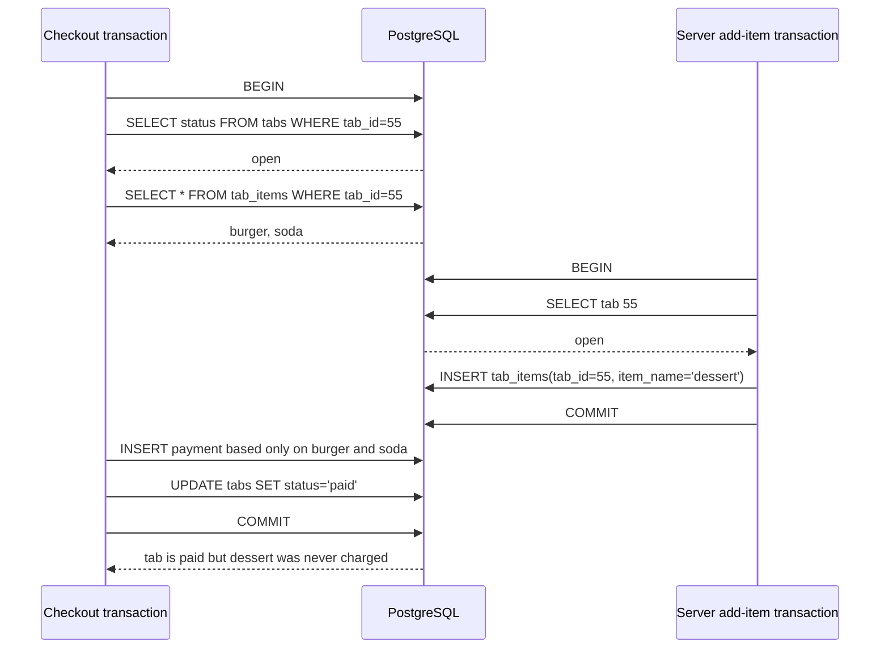
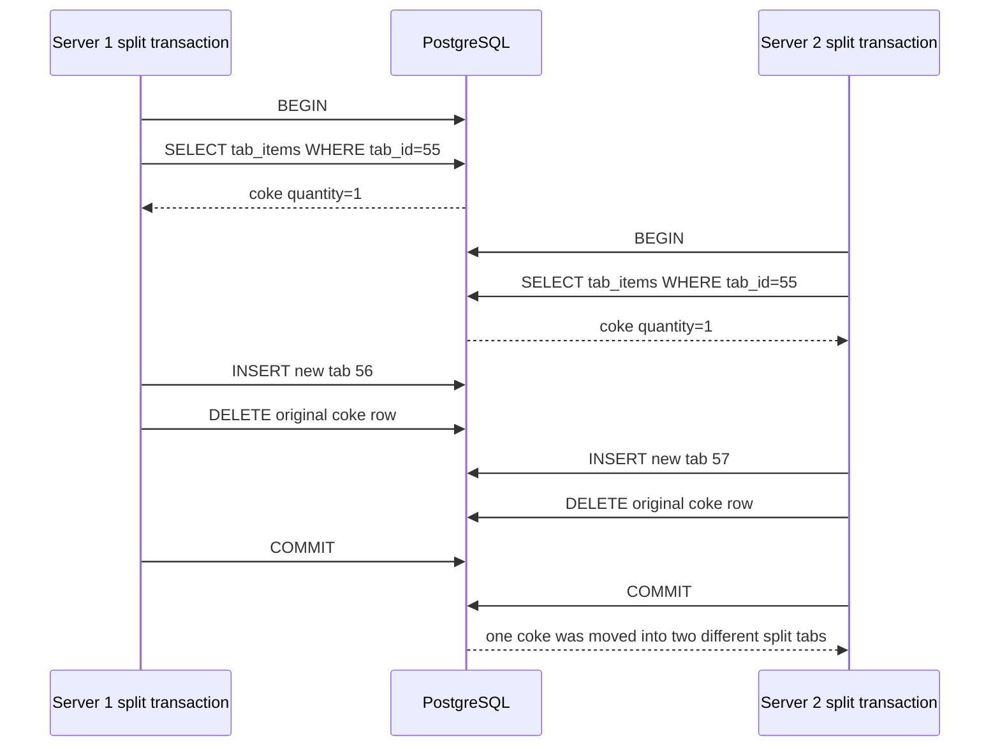

# Concurrency Control

SQueaL is a restaurant table, reservation, and tab service. The main concurrent
users are hosts and servers making overlapping updates to the same tables, tabs,
reservations, and payments.

The service already groups multi-statement writes with SQLAlchemy
`db.engine.begin()`, so each endpoint either commits all of its related SQL work
or rolls it back on error. PostgreSQL's default `READ COMMITTED` isolation also
prevents dirty reads. The checkout endpoint goes further and locks the tab row
with `SELECT ... FOR UPDATE` before it computes the bill, inserts a payment, and
marks the tab paid.

That is the right pattern for most of this service: every operation that mutates
a tab should first lock the parent `tabs` row, and every operation that mutates a
table's reservation or seating state should lock the parent `tables` row. For
reservation availability checks, where correctness depends on the absence of a
matching reservation row, we should also enforce a unique database constraint on
active reservation slots and run the availability transaction at `SERIALIZABLE`
or lock the relevant table row before checking and inserting.

## Controls We Will Use

- Keep all write endpoints inside explicit database transactions.
- Use `SELECT ... FOR UPDATE` on the logical owner row before changing dependent
  rows:
  - `tabs` before adding items, splitting items, or checking out.
  - `tables` before reserving, seating, resetting, or changing occupancy state.
- Recheck business preconditions after acquiring the lock, not before it. For
  example, after locking a tab, verify that `tabs.status = 'open'`.
- Add database constraints for invariants that must never be violated:
  - one successful payment per tab, enforced with a unique key on
    `payments(tab_id)`;
  - one active reservation per table and reservation time, enforced with a
    unique key on `(table_id, reservation_time)` for active reservations.
- Use `SERIALIZABLE` plus retry logic for transactions that choose an available
  table by searching a set of candidates. Row locks are enough when the endpoint
  already targets one known row, but predicate-style availability checks need
  serializable isolation or a database uniqueness constraint to prevent phantoms.

## Case 1: Double Booking A Table

**Phenomenon:** phantom read, with a lost update on `tables.reserved_for`.

Two hosts can try to reserve the same table for the same time. If the service
only checks whether a matching reservation exists and then inserts later, both
transactions can observe "no reservation" before either insert commits.

```mermaid
sequenceDiagram
    participant H1 as Host 1 transaction
    participant DB as PostgreSQL
    participant H2 as Host 2 transaction

    H1->>DB: BEGIN
    H1->>DB: SELECT reservations WHERE table_id=7 AND time='7pm'
    DB-->>H1: no rows
    H2->>DB: BEGIN
    H2->>DB: SELECT reservations WHERE table_id=7 AND time='7pm'
    DB-->>H2: no rows
    H1->>DB: INSERT reservation for Alice
    H1->>DB: UPDATE tables SET reserved_for='Alice'
    H2->>DB: INSERT reservation for Bob
    H2->>DB: UPDATE tables SET reserved_for='Bob'
    H1->>DB: COMMIT
    H2->>DB: COMMIT
    DB-->>H1: two active reservations exist; table display only shows Bob
```

**Isolation plan:** `POST /reservations` should lock the target table row with
`SELECT table_id FROM tables WHERE table_id = :table_id FOR UPDATE`, then check
capacity and existing active reservations, insert the reservation, and update the
table status in the same transaction. A unique constraint on active
`(table_id, reservation_time)` should be the final guardrail. If we later support
"find any available table for this party size and time", that search should use
`SERIALIZABLE` isolation and retry on serialization failure because the
transaction depends on the absence of rows in a predicate range.

**Why this is appropriate:** a reservation for a specific table is owned by one
`tables` row, so a row lock serializes conflicting reservations without blocking
unrelated tables. The unique constraint protects the invariant even if a future
code path forgets to take the lock.

## Case 2: Checkout While Another Server Adds Items

**Phenomenon:** phantom read / serialization anomaly.

A checkout computes the bill by reading all `tab_items` for a tab. At the same
time, another server may add an item to that same tab. Without a shared lock on
the parent tab, checkout can charge the customer for one set of rows while a
newly inserted item appears immediately afterward.



**Isolation plan:** checkout, add-item, and split-item transactions should all
begin by locking the same parent row:

```sql
SELECT tab_id, status
FROM tabs
WHERE tab_id = :tab_id
FOR UPDATE;
```

After the lock is acquired, each transaction should verify that the tab is still
`open`. If checkout gets the lock first, the add-item transaction waits and then
returns a conflict because the tab is already `paid`. If add-item gets the lock
first, checkout waits and then includes the newly committed item in its total.

**Why this is appropriate:** all line items for a bill are logically owned by
the parent tab. Locking that one row is cheaper and clearer than locking the
whole `tab_items` table, and it prevents phantoms for this workflow because every
writer agrees to acquire the same tab lock before inserting or deleting child
rows.

## Case 3: Two Servers Split The Same Item

**Phenomenon:** lost update / serialization anomaly.

The split endpoint reads the available item quantities, creates a new tab, then
deletes or decrements rows from the original tab. If two split transactions move
the same item at the same time, both can base their validation on the same
starting quantity.



**Isolation plan:** `POST /tables/{table_id}/tabs/{tab_id}/split` should lock
the parent `tabs` row before it loads item quantities. It should also perform
the quantity changes with checked updates/deletes inside that same transaction,
so a rowcount of zero is treated as a conflict instead of success. The endpoint
should return `409 Conflict` when a concurrent split or checkout changed the tab
before this split could commit.

**Why this is appropriate:** splitting is a read-modify-write transaction over
the set of items in one tab. `READ COMMITTED` alone gives each statement a fresh
snapshot, but it does not make the whole split behave like one serial action.
The parent-row lock makes every split, add-item, and checkout for the same tab
run in a single order while still allowing different tabs to be split
concurrently.

## Summary

`READ COMMITTED` is sufficient for simple primary-key reads and updates, and it
prevents dirty reads in PostgreSQL. It is not enough by itself for SQueaL's
multi-step restaurant workflows because those workflows validate state, update
dependent rows, and create financial or reservation side effects. The right
concurrency control is short transactions with explicit row locks on the logical
owner row, plus database constraints for invariants and `SERIALIZABLE` isolation
for availability searches that depend on the absence of matching rows.

Citations: ObservableHQ Isolation levels notes.
**ChatGPT used to format rawtext to Markdown.**
