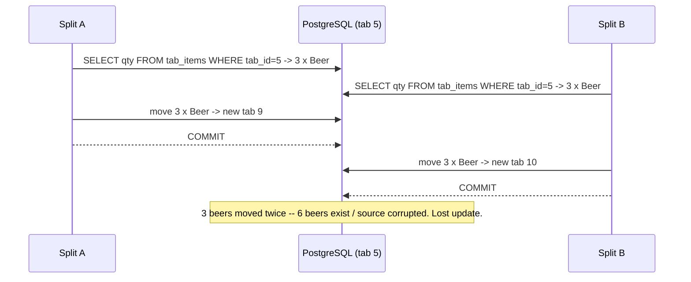

# Concurrency Control in SQueaL

SQueaL runs every request through SQLAlchemy against PostgreSQL, whose default
isolation level is **READ COMMITTED**. READ COMMITTED prevents dirty reads, but
on its own it still allows **non-repeatable reads, phantoms, and lost updates**
across the multiple statements that make up one of our transactions. Several of
our endpoints *read* a tab and then *write* based on what they read, so those
phenomena are real risks here. (Phenomenon definitions:
<https://observablehq.com/@calpoly-pierce/isolation-levels>.)

The hot object in SQueaL is a single **tab** — its row in `tabs` plus its rows
in `tab_items`. Our strategy is **pessimistic row locking**: every transaction
that mutates a tab first runs
`SELECT ... FROM tabs WHERE tab_id = :id FOR UPDATE`, taking an exclusive lock on
that tab's row for the life of the transaction. Operations on *different* tabs
stay fully concurrent; operations on the *same* tab serialize. We prefer this to
raising the whole transaction to `SERIALIZABLE` because the contention is on one
well-identified row, the critical section is short, and `FOR UPDATE` gives
deterministic blocking instead of serialization-failure retries.

Below are three cases where, **without** that control, SQueaL would hit a
concurrency phenomenon.

---

## Case 1 — Lost update: two concurrent checkouts of the same tab

**Transactions:** two instances of `POST /tabs/{tab_id}/checkout`.

**Phenomenon (no control):** both transactions read the tab as `status = 'open'`,
both recompute the bill, and both `INSERT` a `payments` row and set
`status = 'paid'`. The second write is made from a stale read of `status`, so the
first checkout's effect is lost — the guest is charged twice and two payment rows
exist for one tab. This is a **lost update**.

```mermaid
sequenceDiagram
    participant A as Checkout A
    participant DB as PostgreSQL (tab 5)
    participant B as Checkout B
    A->>DB: SELECT status FROM tabs WHERE tab_id=5  -> 'open'
    B->>DB: SELECT status FROM tabs WHERE tab_id=5  -> 'open'
    A->>DB: INSERT payments; UPDATE tabs SET status='paid'
    A-->>DB: COMMIT
    B->>DB: INSERT payments; UPDATE tabs SET status='paid'
    B-->>DB: COMMIT
    Note over DB: Tab 5 charged twice -- two payment rows. Lost update.
```

**Control:** checkout opens with
`SELECT ... FROM tabs WHERE tab_id = :id FOR UPDATE`. Checkout A takes the lock;
Checkout B blocks until A commits, then re-reads `status = 'paid'` and returns
`409 Conflict`. (Already implemented in `checkout.py`.) **Why it fits:** the
conflict is a write-write race on a single row, so a row-level lock is the
minimal, deterministic guard, and under READ COMMITTED the lock holder is
guaranteed to read the latest committed version of the row it locked.

---

## Case 2 — Phantom: an item is added while a tab is being checked out

**Transactions:** `POST /tabs/{tab_id}/checkout` vs.
`PATCH /tables/{table_id}/tabs/{tab_id}` (add items to a tab).

**Phenomenon (no control):** checkout reads the *set* of `tab_items` to total the
bill. A concurrent add-item `INSERT`s a new `tab_items` row and commits *after*
checkout's read but *before* checkout finalizes. That new row is a **phantom** —
it was never in the set checkout billed, so the guest underpays and the item ends
up on a tab that is now closed and paid.

```mermaid
sequenceDiagram
    participant CO as Checkout
    participant DB as PostgreSQL (tab 5)
    participant AI as Add-item
    CO->>DB: SELECT * FROM tab_items WHERE tab_id=5  -> 2 items
    AI->>DB: INSERT tab_items (tab_id=5, 'Wine', 14.00)
    AI-->>DB: COMMIT
    CO->>DB: INSERT payments(total of 2 items); UPDATE tabs SET status='paid'
    CO-->>DB: COMMIT
    Note over DB: 'Wine' never billed -- phantom row on a closed tab.
```

**Control:** the add-item endpoint must take the *same* tab lock
(`SELECT ... FROM tabs WHERE tab_id = :id FOR UPDATE`) before inserting. Because
checkout holds that lock for its whole transaction, a concurrent add-item blocks
until checkout commits — then sees `status = 'paid'` and is rejected; conversely
checkout waits for an in-flight add-item, so its `tab_items` read is complete.
**Why it fits:** serializing every tab mutation on the tab row turns the phantom
into an ordered sequence, at the cost of one row lock rather than the broader
overhead of `SERIALIZABLE`. *(Add-item does not yet take this lock — adopting it
is the fix this case requires.)*

---

## Case 3 — Lost update: two concurrent splits of the same tab

**Transactions:** two instances of
`POST /tables/{table_id}/tabs/{tab_id}/split`.

**Phenomenon (no control):** split reads the available quantity of each item,
checks there is "enough to move," then deletes/decrements `tab_items` and
re-inserts them on a new tab. Two concurrent splits both read the same
availability, both pass the check, and both move the same items — so the items
are moved twice (duplicated onto two new tabs, or the source quantities driven
negative). Each write is based on a stale read of the quantities: a **lost
update** (and a phantom over the `tab_items` set).



**Control:** split must run
`SELECT ... FROM tabs WHERE tab_id = :id FOR UPDATE` before reading the items (it
currently does not). Split B then blocks until Split A commits and re-reads the
*reduced* quantities, so its "enough to move" check is evaluated against the true
remaining stock. **Why it fits:** it is the same single-row pessimistic lock as
checkout — uniform across the codebase, low overhead, and free of serialization
retries.

---

## Summary

| Case | Transactions | Phenomenon | Control |
|------|--------------|------------|---------|
| 1 | checkout × checkout | Lost update | `FOR UPDATE` on the tab row (implemented) |
| 2 | checkout × add-item | Phantom | `FOR UPDATE` on the tab row in add-item |
| 3 | split × split | Lost update | `FOR UPDATE` on the tab row in split |

**One rule:** every transaction that mutates a tab — checkout, split, add-items —
first locks that tab's row with `SELECT ... FOR UPDATE`. Different tabs remain
fully concurrent; operations on the same tab serialize. We stay at PostgreSQL's
default READ COMMITTED isolation everywhere else, since these row locks address
the specific phenomena above without the retry overhead of `SERIALIZABLE`.
